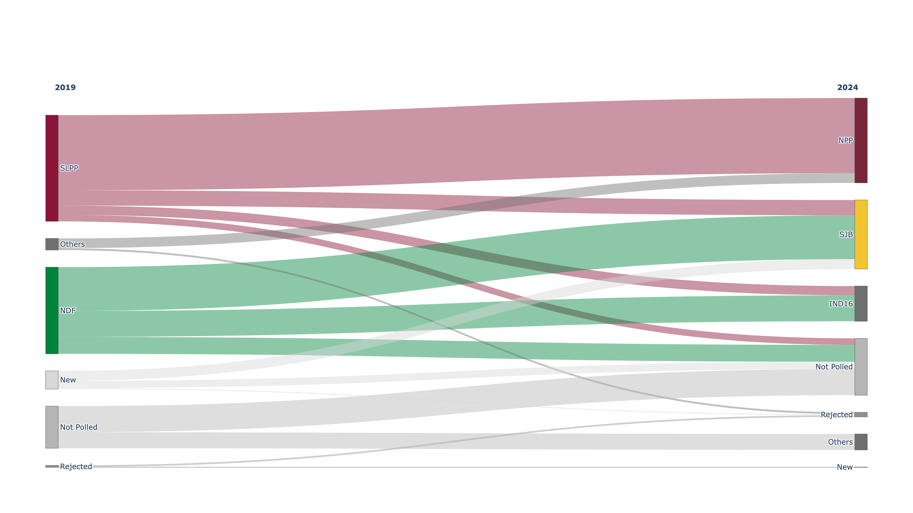

# MarginFlow

**Estimate latent transitions from grouped marginal data.**

MarginFlow estimates how a population may have moved between categorical
states when only group totals from two points in time are available. Examples
include movement between customer tiers, employment categories, health states,
survey responses, or electoral choices.

## The idea

For each group, $X$ contains source-category counts and $Y$ contains
target-category counts. MarginFlow estimates a shared transition matrix $P$,
where each entry is the probability of moving from one source category to one
target category:

$$
P_{ij}=\Pr(\text{target}=j\mid\text{source}=i).
$$

Every probability is non-negative and every row sums to one. The model predicts
target proportions with $Y\approx XP$ and fits $P$ by constrained maximum
likelihood. Estimated aggregate flows are the source totals multiplied by the
corresponding transition probabilities.

Marginal totals do not uniquely reveal individual transitions. The result is a
model-based estimate, not a reconstruction of individual records. It is most
informative when groups have varied source compositions and represent the same
population at both times.

## The algorithm

MarginFlow first converts each group's source counts into proportions. It then
searches for the transition matrix whose predicted target proportions best
explain the observed target counts. A softmax transformation keeps every
candidate probability non-negative and makes each row sum to one.

<!-- markdownlint-disable MD010 -->

```text
VALIDATE X and Y have matching groups and population totals
SET source proportions from each row of X
SET adjustable scores for each transition row

REPEAT
 SET transition probabilities from scores using softmax
 SET predicted target proportions = source proportions x transition matrix
 CALCULATE negative multinomial log likelihood from Y
 UPDATE scores to reduce the negative log likelihood
UNTIL the fit stops improving

RETURN the best-fitting transition matrix
```

<!-- markdownlint-enable MD010 -->

For group $g$, let $n_g$ be its population and $S$ its source proportions:

$$
n_g=\sum_i X_{gi}=\sum_j Y_{gj},
\qquad
S_{gi}=\frac{X_{gi}}{n_g}.
$$

Unrestricted scores $Z$ become a row-stochastic transition matrix through the
softmax, and that matrix predicts target proportions $Q$:

$$
P_{ij}(Z)=\frac{e^{Z_{ij}}}{\sum_k e^{Z_{ik}}},
\qquad
Q_{gj}=\sum_i S_{gi}P_{ij}(Z).
$$

The fitted scores minimize the negative multinomial log likelihood:

$$
\widehat{Z}=\arg\min_Z
\left[-\sum_g\sum_j Y_{gj}\log Q_{gj}\right],
\qquad
\widehat{P}=P(\widehat{Z}).
$$

## Proof on synthetic data

One deterministic unit test uses three groups whose result can be checked by
inspection:

$$
X=
\begin{bmatrix}
1000 & 0 \\
0 & 1000 \\
500 & 500
\end{bmatrix},
\qquad
Y=
\begin{bmatrix}
800 & 200 \\
300 & 700 \\
550 & 450
\end{bmatrix}.
$$

The first group contains only source A, so its 800:200 target split directly
reveals the first transition row, $(0.8,0.2)$. The second contains only source
B and reveals $(0.3,0.7)$. The third is a 50:50 mix, so its expected target
counts are their average:

$$
\left(\frac{800+300}{2},\frac{200+700}{2}\right)=(550,450).
$$

The known matrix is therefore:

$$
P=
\begin{bmatrix}
0.8 & 0.2 \\
0.3 & 0.7
\end{bmatrix}.
$$

Using only $X$ and $Y$, MarginFlow infers:

$$
\widehat{P}=
\begin{bmatrix}
0.800000 & 0.200000 \\
0.300000 & 0.700000
\end{bmatrix},
\qquad
\mathrm{MAE}(\widehat{P},P)<10^{-8}.
$$

## Use the library

```python
import numpy as np

from marginflow import MarginFlowModel

X = np.array([[1000, 0], [0, 1000], [500, 500]])
Y = np.array([[800, 200], [300, 700], [550, 450]])

model = MarginFlowModel().fit(X, Y)
print(model.transition_matrix_)
```

Synthetic recovery verifies the implementation when its model assumptions are
true; it does not prove those assumptions for real populations.

## Case study: Sri Lankan presidential elections

Sri Lanka has no nationwide exit polls linking voters' previous and current
choices. Official results therefore show where each election ended, but not
how support moved between parties. MarginFlow uses polling-division totals to
estimate those otherwise unobserved movements while keeping estimates distinct
from observed voter histories.

The election example compares polling-division totals from 2019 and 2024.
Parties with at least 5% of the national vote remain separate; smaller parties
are combined as `Others`. `Rejected`, `Not Polled`, and `New` categories keep
the population totals comparable between elections.



The full inputs contain one row for each of 160 polling divisions. Their
national aggregate matrices are shown here to keep the case study readable.
The columns of $X_\Sigma$ and rows of $\widehat P$ are `SLPP`, `NDF`, `Others`,
`Rejected`, `Not Polled`, and `New`:

$$
X_\Sigma=\sum_g X_{g\cdot}
=\begin{bmatrix}
6{,}548{,}292 & 5{,}345{,}907 & 716{,}660 & 125{,}956 &
2{,}596{,}522 & 1{,}117{,}517
\end{bmatrix}.
$$

The columns of $\widehat P$ and $Y_\Sigma$ are `NPP`, `SJB`, `IND16`,
`Others`, `Rejected`, `Not Polled`, and `New`:

$$
\widehat P=
\begin{bmatrix}
0.707565 & 0.144178 & 0.087003 & 0       & 0        & 0.061254 & 0 \\
0        & 0.505645 & 0.299144 & 0.000001& 0        & 0.195209 & 0 \\
0.833758 & 0.000001 & 0.001678 & 0.000009& 0.163806 & 0.000745 & 0.000002 \\
0.000007 & 0.000153 & 0.000398 & 0.002756& 0.824003 & 0.000404 & 0.172279 \\
0        & 0        & 0.000001 & 0.379049& 0        & 0.620950 & 0 \\
0.000027 & 0.543568 & 0.000003 & 0.000003& 0.052496 & 0.403903 & 0
\end{bmatrix}.
$$

$$
Y_\Sigma=\sum_g Y_{g\cdot}
=\begin{bmatrix}
5{,}245{,}118 & 4{,}234{,}428 & 2{,}160{,}368 & 992{,}089 &
283{,}792 & 3{,}512{,}252 & 22{,}807
\end{bmatrix}.
$$

Each Sankey link uses the raw estimated count
$\widehat F_{ij}=X_{\Sigma,i}\widehat P_{ij}$. For example, the SLPP-to-NPP
link represents $6{,}548{,}292\times0.707565\approx4{,}633{,}344$ people. The
diagram shows only links with $\widehat P_{ij}\geq0.05$.

The fitted model estimates that 70.8% of the 2019 SLPP-associated population
moved to NPP in 2024, while 14.4% moved to SJB and 8.7% to the independent
candidate recorded as `IND16`. For the 2019 NDF-associated population, the
largest estimated flows are 50.6% to SJB and 29.9% to `IND16`.

These are **model-estimated latent transitions**, not observed voter histories.
The grouped results cannot show how any individual voted, and geographic or
demographic differences between polling divisions may influence the estimates.
